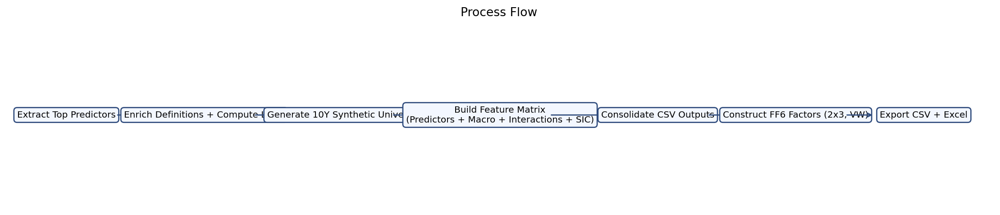
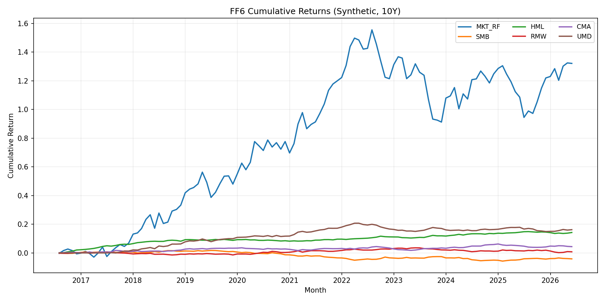
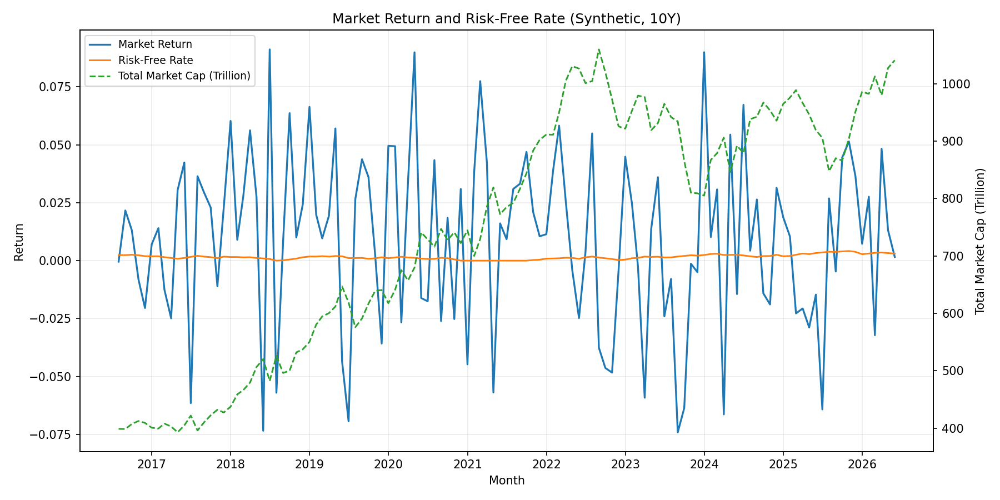
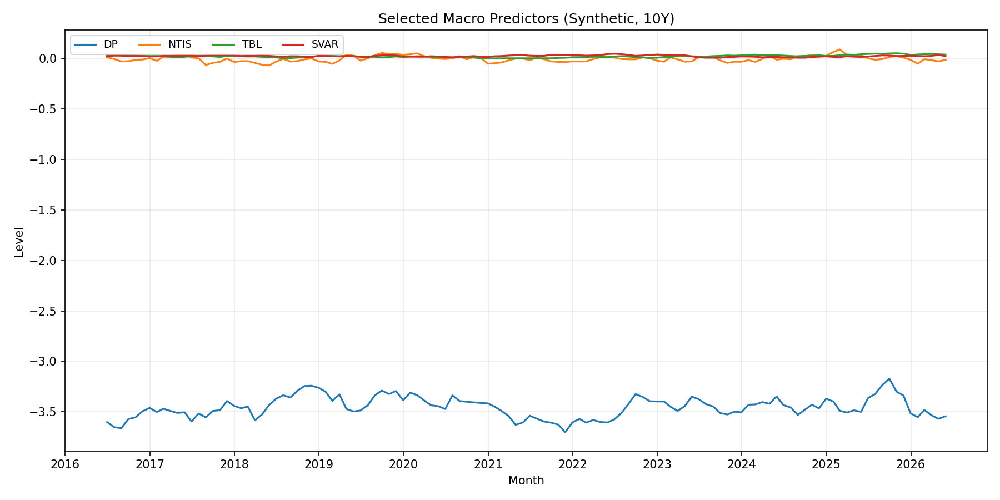

# Process Flow

1. Extract top predictor variables from the ML paper (Figure 4, page 33).
2. De-duplicate variables and enrich with descriptions, definitions, and compute logic.
3. Generate a 10-year monthly synthetic equity universe with dynamic entry/exit rules.
4. Build stock-level feature data (predictors, macro variables, interactions, SIC one-hot).
5. Consolidate all months into single CSV outputs for modeling convenience.
6. Build FF6 factor series from existing generated data using 2x3 value-weighted sorts.
7. Export all key outputs to CSV and Excel and validate structure/content.

# Requirements
1. Use only top variables from the target paper figure and remove duplicates.
2. Include variable definitions and “how to compute” guidance.
3. Generate realistic synthetic data for ~3,000 equities over 10 years (monthly).
4. Keep universe dynamic across months (adds/removals).
5. Produce one consolidated stock-level dataset across all months.
6. Provide macro variables separately.
7. Include interaction terms and SIC one-hot encoding.
8. Keep SIC assignment consistent per ticker across all months/years.
9. Construct FF6 factors with value-weighted market return and standard 2x3 methodology.
10. Output deliverables in both CSV and Excel where requested.

# What We Achieved
1. Delivered enriched predictor outputs with definitions and compute formulas.
2. Delivered synthetic market panel and dynamic universe membership files.
3. Delivered consolidated all-month feature dataset with predictors, macro, interactions, and SIC dummies.
4. Delivered separate macro predictor CSV.
5. Delivered FF6 factor time series (Mkt-RF, SMB, HML, RMW, CMA, UMD) with total market cap, market return, and risk-free rate.
6. Produced corresponding Excel outputs for factor series.

# Key Deliverables
1. synthetic_data/csv_outputs/synthetic_predictor_features_all_months.csv
2. synthetic_data/csv_outputs/synthetic_macro_variables.csv
3. synthetic_data/csv_outputs/ff6_factors_10y.csv
4. synthetic_data/csv_outputs/ff6_factors_10y.xlsx
